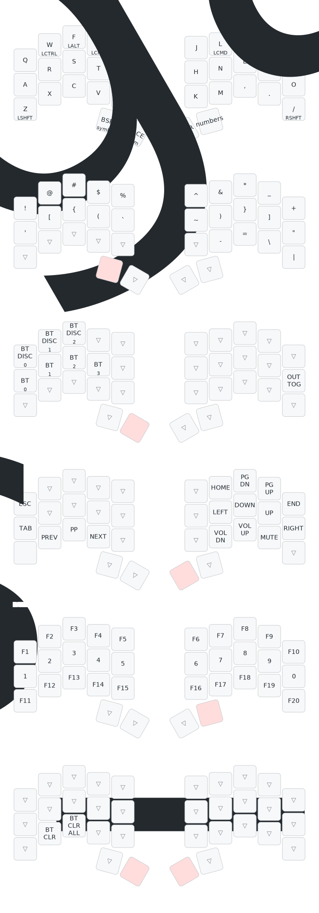

# 34-key Colemak ZMK Configuration for Cradio (Ferris Sweep)

My layout for the awesome [Ferris Sweep][ferris-sweep], a custom 34-key wireless keyboard (17 keys per half).
<!-- TODO: Add a picture of my keyboard once it's all finished -->

This ZMK configuration is Nix-based, and uses [zmk-nix][zmk-nix] (Thanks [@lilyinstarlight][@lilyinstarlight] for the awesome project).

I used the awesome [Keymap Drawer](https://keymap-drawer.streamlit.app/) to generate a visualization of my layout below:

<!-- TODO: Once https://github.com/lilyinstarlight/zmk-nix/pull/86 is merged, update the asset via CI and file a PR -->

[ferris-sweep]: https://github.com/davidphilipbarr/Sweep
[zmk-nix]: https://github.com/lilyinstarlight/zmk-nix
[@lilyinstarlight]: https://github.com/lilyinstarlight
