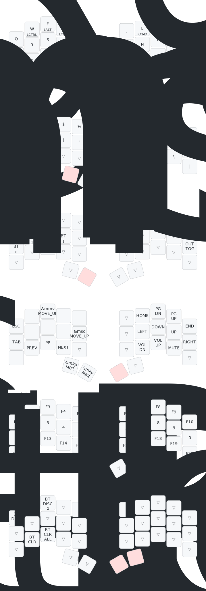
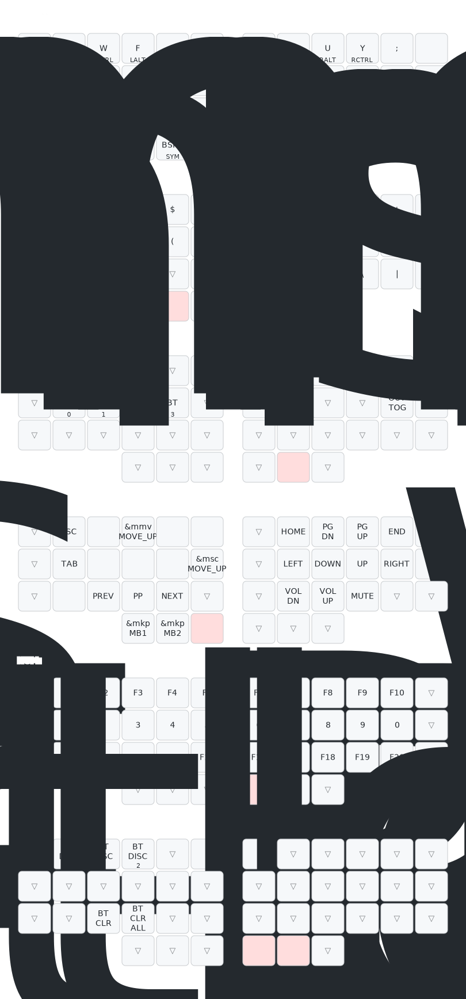

# Colemak ZMK Configuration

My Nix-based ZMK firmware configuration, built with [zmk-nix][zmk-nix]
(thanks [@lilyinstarlight][@lilyinstarlight]).

## Keyboards

### Cradio (Ferris Sweep) — 34 keys

A custom 34-key wireless split keyboard (17 keys per half).

```
nix build .#cradio.firmware
nix run   .#cradio.flash
```



---

### Toucan — 36 keys

A 36-key wireless split keyboard with Cirque trackpad, RGB LED, and
nice!view display on the left half.

```
nix build .#toucan.firmware
nix run   .#toucan.flash
```



---

## Keymap visualizations

Generated with [Keymap Drawer](https://keymap-drawer.streamlit.app/)
via `nix run .#update-assets`.

[ferris-sweep]: https://github.com/davidphilipbarr/Sweep
[zmk-nix]: https://github.com/lilyinstarlight/zmk-nix
[@lilyinstarlight]: https://github.com/lilyinstarlight
